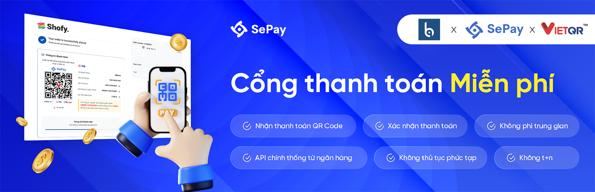

# SePay

Plugin này cho phép bạn tích hợp SePay để tự động xác thực thanh toán qua phương thức chuyển khoản ngân hàng.

## Yêu cầu tối thiểu

- Botble core 7.3.2 hoặc cao hơn.
- Sử dụng tiền Việt (Đồng, VND) làm mặc định khi sử dụng phương thức thanh toán SePay. Số tiền được chuyển vào chỉ tính trên 1 lần và phải bằng hoặc lớn hơn tổng số tiền cần thanh toán cho 1 đơn.

## Cài đặt

### Cài đặt thông qua bảng quản trị

1. Vào **Bảng quản trị (Admin)** và chọn **Plugins**
2. Bấm vào nút "Thêm mới (Add New Plugin)"
3. Tìm kiếm plugin **SePay**
4. Bấm vào "Cài đặt (Install)"

## Cách sử dụng

1. Vào **Bảng quản trị (Admin)**, chọn **Thanh toán (Payments)**, và bấm vào **Phương thức thanh toán (Payment Methods)**
2. Kích hoạt **SePay**
3. Nhấn vào nút "Kết nối với SePay" và chọn tài khoản ngân hàng bạn muốn sử dụng
4. Sau khi kết nối thành công, bạn có thể sử dụng phương thức thanh toán này ngay lập tức

## Lịch sử thay đổi

Vui lòng xem [LỊCH SỬ THAY ĐỔI](CHANGELOG.md) để biết chi tiết.

## Bảo mật

Nếu bạn phát hiện bất kỳ vấn đề liên quan đến bảo mật nào, vui lòng gửi email tới friendsofbotble@gmail.com thay vì sử dụng issues.

## Đóng góp

- [Friends Of Botble](https://github.com/FriendsOfBotble)
- [Tất cả các đóng góp viên](../../contributors)

## Giấy phép

MIT License (MIT). Vui lòng xem chi tiết trong phần [thông tin giấy phép](LICENSE).
